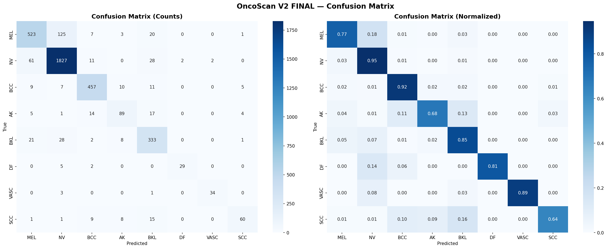
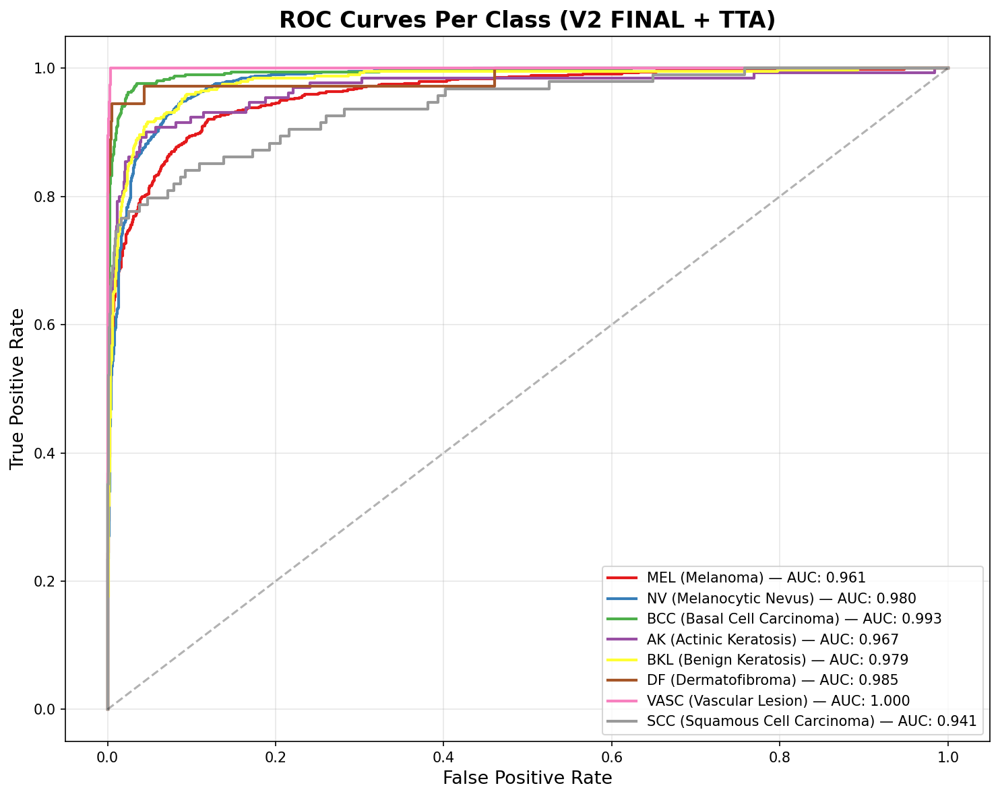
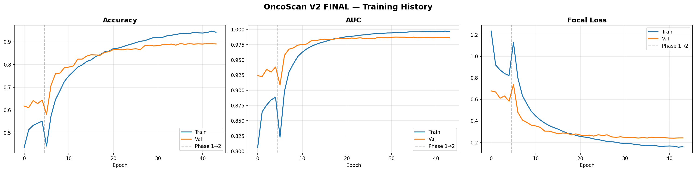
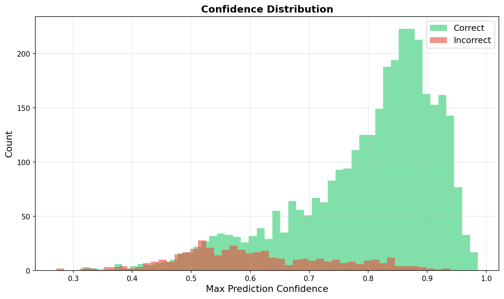

<p align="center">
  
</p>

<h1 align="center">🧬 OncoScan — AI-Powered Skin Cancer Detection</h1>

<p align="center">
  <b>Multi-class dermatoscopic lesion classification using EfficientNet-B4 with clinical metadata fusion</b>
</p>

<p align="center">
  
  
  
  
  
</p>

---

## 📋 Table of Contents

- [Overview](#-overview)
- [Architecture](#-architecture)
- [Dataset](#-dataset--preprocessing)
- [Training Strategy](#-training-strategy)
- [Performance Metrics](#-performance-metrics)
- [Per-Class Analysis](#-per-class-analysis)
- [Binary Classification](#-binary-classification-malignant-vs-benign)
- [Confidence Thresholding](#-confidence-thresholding--ood-handling)
- [Tech Stack](#-tech-stack)
- [Project Structure](#-project-structure)

---

## 🎯 Overview

OncoScan is an end-to-end deep learning system for automated skin lesion classification from dermatoscopic images. It classifies lesions into **8 diagnostic categories** — 4 malignant and 4 benign — and provides a binary cancer risk assessment by grouping predictions.

The system employs a **dual-input architecture** that fuses high-resolution image features extracted by a pretrained EfficientNet-B4 backbone with structured clinical metadata (patient age, sex, anatomical site), enabling context-aware diagnosis that mirrors clinical decision-making.

### Key Capabilities
- 🔬 **8-class differential diagnosis** across the most common skin lesion types
- 🧮 **Binary malignancy assessment** derived from class-level probability aggregation
- 📊 **Confidence-calibrated predictions** with tunable decision thresholds
- 🩺 **Clinical metadata integration** — age, sex, and anatomical site influence the prediction
- ⚡ **Test-Time Augmentation (TTA)** with 8 geometric transforms for robust inference

---

## 🧠 Architecture

OncoScan uses a **multi-modal fusion architecture** that combines convolutional image features with tabular clinical metadata through late fusion.

```
┌──────────────────────────────────────────────────────────────────┐
│                        IMAGE BRANCH                              │
│                                                                  │
│   Input: 456 × 456 × 3 (RGB dermatoscopic image)               │
│     │                                                            │
│     ├── EfficientNet-B4 (ImageNet pretrained, top 50% unfrozen) │
│     │     └── Compound Scaling: depth=1.8, width=1.4, res=1.3   │
│     │                                                            │
│     ├── Global Average Pooling 2D                                │
│     └── 1792-dim feature vector                                  │
│                                                                  │
├──────────────────────────────────────────────────────────────────┤
│                      METADATA BRANCH                             │
│                                                                  │
│   Input: 9 features                                              │
│     ├── age_normalized (continuous, /90)                         │
│     ├── sex_encoded (binary)                                     │
│     └── anatomical_site (7-dim one-hot)                          │
│           [anterior_torso, head_neck, lower_extremity,           │
│            posterior_torso, upper_extremity, other, unknown]      │
│     │                                                            │
│     ├── Dense(64, ReLU) → BatchNorm → Dropout(0.3)              │
│     ├── Dense(32, ReLU) → ModalityDropout(0.5)                  │
│     └── 32-dim feature vector                                    │
│                                                                  │
├──────────────────────────────────────────────────────────────────┤
│                       FUSION HEAD                                │
│                                                                  │
│   Concatenate(1792 + 32 = 1824)                                  │
│     ├── Dense(256, ReLU) → BatchNorm → Dropout(0.4)             │
│     ├── Dense(128, ReLU) → Dropout(0.3)                         │
│     └── Dense(8, Softmax) → 8-class probability distribution    │
│                                                                  │
│   Post-hoc Binary Grouping:                                      │
│     Malignant = P(MEL) + P(BCC) + P(AK) + P(SCC)               │
│     Benign    = P(NV)  + P(BKL) + P(DF) + P(VASC)              │
└──────────────────────────────────────────────────────────────────┘
```

### Custom Components

| Component | Description |
|-----------|-------------|
| **ModalityDropout** | Stochastically zeros the entire metadata branch during training (rate=0.5), forcing the image branch to learn independently. Prevents the model from over-relying on metadata shortcuts. |
| **Focal Loss** | γ=2.0 with label smoothing (ε=0.02). Down-weights well-classified samples, focusing gradient updates on hard/rare classes like SCC and AK. |
| **TTA (8 transforms)** | At inference: original, horizontal flip, vertical flip, 90°/180°/270° rotations, and flip+rotate combinations. Predictions are averaged for robustness. |

---

## 📊 Dataset & Preprocessing

| Property | Detail |
|----------|--------|
| **Source** | [ISIC 2019 Challenge](https://challenge.isic-archive.com/landing/2019/) — International Skin Imaging Collaboration |
| **Composition** | HAM10000 + BCN20000 + MSK clinical datasets |
| **Total Images** | 25,331 dermatoscopic images |
| **Resolution** | Resized to **456 × 456** (native EfficientNet-B4 optimal) |
| **Classes** | 8 diagnostic categories |
| **Metadata** | Patient age, sex, anatomical site (localization) |
| **Split** | 70% train / 15% validation / 15% test (stratified) |

### Class Distribution & Grouping

| Class | Abbreviation | Category | Original Count | After Oversampling |
|-------|-------------|----------|---------------:|-------------------:|
| Melanocytic Nevus | NV | 🟢 Benign | 12,875 | 12,875 |
| Melanoma | MEL | 🔴 Malignant | 4,522 | 4,522 |
| Basal Cell Carcinoma | BCC | 🔴 Malignant | 3,323 | 3,323 |
| Benign Keratosis | BKL | 🟢 Benign | 2,624 | 2,624 |
| Actinic Keratosis | AK | 🔴 Malignant | 867 | 1,500+ |
| Squamous Cell Carcinoma | SCC | 🔴 Malignant | 628 | 1,500+ |
| Vascular Lesion | VASC | 🟢 Benign | 253 | 1,500+ |
| Dermatofibroma | DF | 🟢 Benign | 239 | 1,500+ |

> **Imbalance Handling**: Minority classes (< 1,500 samples) are oversampled via random replication to a minimum of 1,500 samples/class, combined with Focal Loss for gradient-level rebalancing.

### Augmentation Pipeline (Albumentations)

```python
A.Compose([
    A.HorizontalFlip(p=0.5),
    A.VerticalFlip(p=0.5),
    A.RandomRotate90(p=0.5),
    A.ShiftScaleRotate(shift_limit=0.1, scale_limit=0.15, rotate_limit=30, p=0.5),
    A.OneOf([
        A.GaussNoise(var_limit=(10, 50)),
        A.GaussianBlur(blur_limit=(3, 7)),
    ], p=0.3),
    A.ColorJitter(brightness=0.2, contrast=0.2, saturation=0.2, hue=0.1, p=0.4),
    A.CoarseDropout(max_holes=8, max_height=40, max_width=40, fill_value=0, p=0.3),
])
```

---

## ⚙️ Training Strategy

### Two-Phase Transfer Learning

```
Phase 1: Feature Extraction (5 epochs)
  ├── Backbone: EfficientNet-B4 (FROZEN)
  ├── Learning Rate: 1e-3
  ├── Optimizer: AdamW (weight_decay=1e-5)
  └── Purpose: Warm up fusion head without destroying pretrained weights

Phase 2: Fine-Tuning (40 epochs, early stopped at 39)
  ├── Backbone: Top 50% layers UNFROZEN
  ├── Learning Rate: 1e-4 → 1e-6 (cosine annealing with 3-epoch warmup)
  ├── Optimizer: AdamW (weight_decay=1e-5, clipnorm=1.0)
  ├── Early Stopping: patience=12 on val_auc
  └── Best Checkpoint: Epoch 27 (val_auc = 0.9874)
```

### Hyperparameter Summary

| Parameter | Value |
|-----------|-------|
| Backbone | EfficientNet-B4 (ImageNet) |
| Input Resolution | 456 × 456 |
| Batch Size | 12 |
| Loss Function | Focal Loss (γ=2.0, label_smoothing=0.02) |
| Optimizer | AdamW (weight_decay=1e-5, gradient_clipnorm=1.0) |
| LR Schedule | Cosine annealing (3-epoch warmup → decay to 1e-6) |
| Regularization | Dropout (0.3–0.4), ModalityDropout (0.5), Label Smoothing |
| Oversampling | Min 1,500 samples/class |
| TTA at inference | 8 geometric transforms |

---

## 📈 Performance Metrics

### Overall Test Set Performance (n = 3,800)

| Metric | Value |
|--------|-------|
| **Test Accuracy** | **88.2%** |
| **AUC (macro-averaged)** | **0.9757** |
| **AUC (weighted)** | **0.9769** |
| **F1 Score (macro)** | **0.8365** |
| **F1 Score (weighted)** | **0.8806** |
| **Binary Accuracy** (Malignant vs Benign) | **91.9%** |
| **Binary AUC** | **0.9709** |

### Training Convergence

| Phase | Best Val Accuracy | Best Val AUC | Best Epoch |
|-------|:-----------------:|:------------:|:----------:|
| Phase 1 (frozen) | 69.1% | 0.9484 | 5/5 |
| Phase 2 (fine-tune) | **87.8%** | **0.9874** | **27/40** |

> Early stopping triggered at epoch 39 (patience=12 from epoch 27 peak). Validation curves closely track training curves — **no overfitting detected**.

---

## 🔍 Per-Class Analysis

### Classification Report

| Class | Precision | Recall | F1-Score | AUC | Support |
|-------|:---------:|:------:|:--------:|:---:|--------:|
| **MEL** (Melanoma) | 0.844 | 0.770 | 0.805 | 0.960 | 679 |
| **NV** (Melanocytic Nevus) | 0.915 | 0.946 | 0.930 | 0.977 | 1,931 |
| **BCC** (Basal Cell Carcinoma) | 0.910 | 0.916 | 0.913 | **0.993** | 499 |
| **AK** (Actinic Keratosis) | 0.754 | 0.685 | 0.718 | 0.954 | 130 |
| **BKL** (Benign Keratosis) | 0.784 | 0.847 | 0.814 | 0.978 | 393 |
| **DF** (Dermatofibroma) | 0.936 | 0.806 | 0.866 | 0.988 | 36 |
| **VASC** (Vascular Lesion) | 0.944 | 0.895 | 0.919 | 0.987 | 38 |
| **SCC** (Squamous Cell Carcinoma) | 0.845 | 0.638 | 0.727 | 0.941 | 94 |
| | | | | | |
| **Macro Average** | **0.866** | **0.813** | **0.837** | **0.976** | 3,800 |
| **Weighted Average** | **0.881** | **0.882** | **0.881** | **0.977** | 3,800 |

> 📌 **All 8 classes achieve AUC > 0.94** — the model learns discriminative features across every diagnostic category. BCC achieves the highest AUC (0.993) among malignant types.

### Key Confusion Patterns

```
MEL → NV:   ~17% misclassified  (melanoma mistaken for benign mole — clinically significant)
SCC → AK:   ~14% misclassified  (histologically similar keratinizing lesions)
SCC → BCC:  ~11% misclassified  (both malignant — lower clinical risk)
AK  → BCC:  ~13% misclassified  (both malignant — lower clinical risk)
BKL → NV:   ~10% misclassified  (both benign — no clinical risk)
```

---

## 🔴 Binary Classification (Malignant vs Benign)

Class-level probabilities are aggregated for binary risk assessment:

```
P(Malignant) = P(MEL) + P(BCC) + P(AK) + P(SCC)
P(Benign)    = P(NV)  + P(BKL) + P(DF) + P(VASC)
```

| Category | Precision | Recall | F1-Score | Support |
|----------|:---------:|:------:|:--------:|--------:|
| **Benign** | 0.920 | 0.956 | 0.937 | 2,398 |
| **Malignant** | 0.919 | 0.857 | 0.887 | 1,402 |
| **Overall** | **0.919** | **0.907** | **0.912** | **3,800** |

| Metric | Value |
|--------|-------|
| **Binary Accuracy** | **91.9%** |
| **Binary AUC (ROC)** | **0.9709** |

---

## 🎚️ Confidence Thresholding & OOD Handling

The model supports **tunable confidence thresholds** — predictions below the threshold are flagged as "uncertain" and deferred for clinical review.

| Confidence Threshold | Accuracy | Coverage | Recommended Use |
|:--------------------:|:--------:|:--------:|-----------------|
| 0.3 | 88.3% | 99.9% | Accept all predictions |
| 0.4 | 88.6% | 99.1% | Minimal filtering |
| **0.5** | **90.1%** | **95.4%** | ✅ **Production default** |
| 0.6 | 93.6% | 85.9% | Conservative screening |
| 0.7 | 95.9% | 74.6% | High-confidence only |
| 0.8 | 97.4% | 55.3% | Maximum precision |

> At threshold **0.7**, the system achieves **95.9% accuracy** on the 74.6% of cases it is confident about — the remaining 25.4% are flagged for manual dermatological review.

---

## 🛠️ Tech Stack

| Layer | Technology |
|-------|-----------|
| **Deep Learning Framework** | TensorFlow 2.19 / Keras 3.9 |
| **Backbone Architecture** | EfficientNet-B4 (ImageNet pretrained) |
| **Loss Function** | Custom Focal Loss with label smoothing |
| **Augmentation** | Albumentations (geometric + color + dropout) |
| **Training Infrastructure** | Kaggle GPU (NVIDIA T4 / P100) |
| **Backend** | Gradio + FastAPI (hybrid REST + Gradio API) |
| **Frontend** | Vanilla HTML/CSS/JS with responsive design |
| **Language** | Python 3.12 |

---

## 📁 Project Structure

```
OncoScan---Skin-Cancer-Detection/
│
├── model/
│   ├── oncoscan_v2_final_best.keras     # Best checkpoint (epoch 27, val_auc=0.9874)
│   └── oncoscan_v2_final_config.json    # Class names, indices, hyperparameters
│
├── results/
│   ├── confusion_matrix.png             # 8×8 normalized confusion matrix
│   ├── roc_curves.png                   # Per-class ROC curves with AUC
│   ├── training_curves.png              # Accuracy & loss over epochs
│   ├── confidence_dist.png              # Confidence distribution histogram
│   └── oncoscan_v2_final_metrics.md     # Full metrics report
│
├── app.py                               # Gradio + FastAPI backend (ZeroGPU compatible)
├── training.py                          # Complete training pipeline (Kaggle)
├── dataset_exploration.py               # EDA and dataset analysis
│
├── index.html                           # Frontend UI
├── styles.css                           # Responsive CSS
├── script.js                            # API integration & result rendering
│
├── requirements.txt                     # Python dependencies
└── README.md                            # This file
```

---

## 📊 Evaluation Visualizations

<p align="center">
  
  &nbsp;&nbsp;&nbsp;
  
</p>

<p align="center">
  
  &nbsp;&nbsp;&nbsp;
  
</p>

---

## 📜 Citation

If you use this work, please cite the ISIC 2019 dataset:

```
@article{tschandl2018ham10000,
  title={The HAM10000 dataset, a large collection of multi-source dermatoscopic images of common pigmented skin lesions},
  author={Tschandl, Philipp and Rosendahl, Cliff and Kittler, Harald},
  journal={Scientific Data},
  volume={5},
  pages={180161},
  year={2018}
}

@article{combalia2019bcn20000,
  title={BCN20000: Dermoscopic lesions in the wild},
  author={Combalia, Marc and others},
  journal={arXiv preprint arXiv:1908.02288},
  year={2019}
}
```

---

<p align="center">
  <b>⚠️ Disclaimer</b>: OncoScan is a screening assistance tool for research and educational purposes. It does not replace professional medical diagnosis. Always consult a board-certified dermatologist for clinical decisions.
</p>
